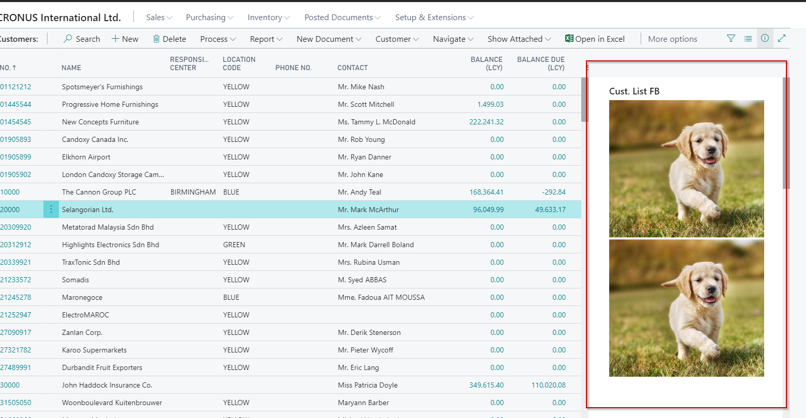
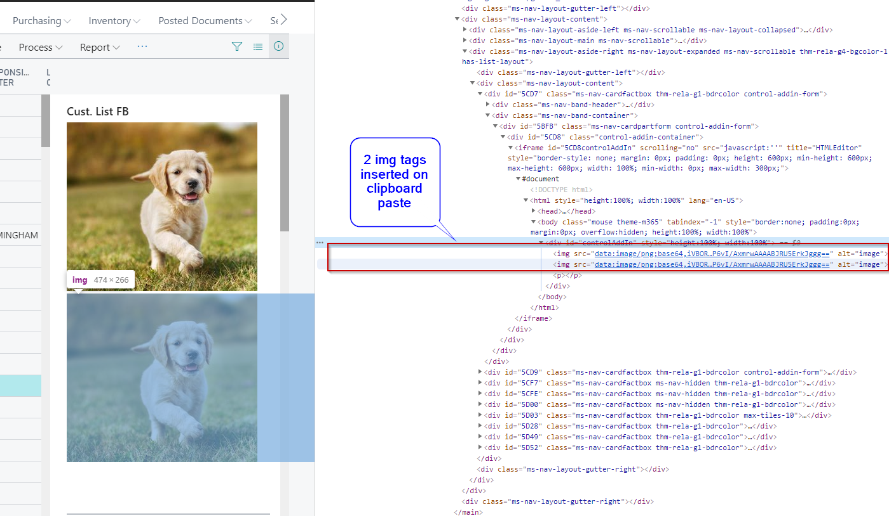

# BC365ClipboardPaste
A simple extension on how to paste an image file from clipboard onto an HTML div in BC365 control-addin.

1. Copy contents of ClipboardPase folder to your project folder.
2. Run the project and open Page 22 (Customer list)
3. Copy an image file, click on an area of HTMLEditor Factbox, hit CTRL+V and image will appear.

Ideally, you would want to keep the results in a blob when page is closed.

After 

Page source divs with images

Cheers!
